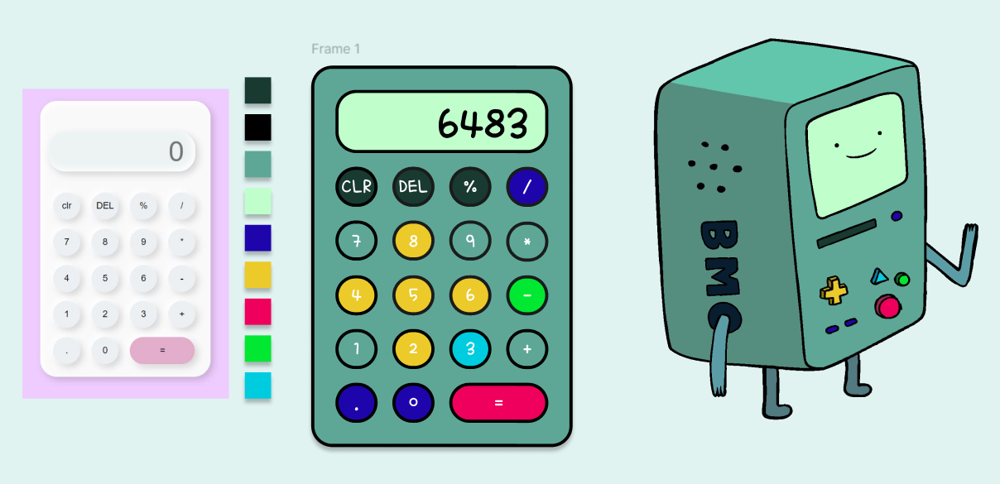

# 🎮 BMO Calculator

A playful calculator app inspired by **BMO** from _Adventure Time_!  
This was my **first project using HTML, CSS, and JavaScript**, and also my **first time designing in Figma**. I built this to combine learning frontend development with my love for design 💚

## ✨ Project Highlights

### MVP 1: First Launch

🟢 **Built a BMO-inspired calculator from scratch** using:

- HTML
- CSS
- JavaScript
- Custom Figma design

🎨 The interface mimics BMO’s color palette and vibe, with a custom-styled keypad and display.

📹 Watch MVP1 in action:

---

### MVP 2: Smarter BMO Calculator (in progress!)

🧠 Added logic improvements and began tackling real-world usability challenges.

#### ✅ What’s New:

- Full equation support with **BODMAS** logic (e.g., `2 + 3 × 4 = 14`)
- Formula line added above the result display
- Fixed several edge cases for better calculation accuracy

📹 Watch MVP2 in action:

## 🔧 Future steps:

- ➖ Support for **negative numbers**
- 🚫 Smart **text overflow prevention**

#### 📝 Fun Future Ideas:

- Voice input (just for fun!)
- BMO sound effects
- Dark mode toggle
- More animated UI interactions

## 💡 What I Learned

- Structuring a project using **HTML/CSS/JS**
- Creating responsive, styled UI with Figma
- Managing calculator logic (including operator precedence and edge cases)
- Planning and tracking MVP features

## 🧩 Tech Stack

- HTML5
- CSS3
- JavaScript (Vanilla)
- Figma (for UI design)

---

Thanks for checking out my calculator! 😊
